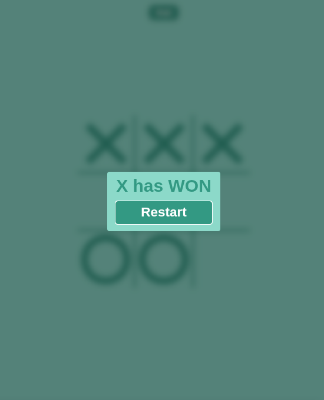

# 🎮 Tic Tac Toe PWA

A modern, accessible Progressive Web App implementation of the classic Tic Tac Toe game with near-perfect Lighthouse scores.

## ✨ Features

- 🎮 Classic Tic Tac Toe gameplay with intuitive controls
- 📱 **Progressive Web App** - installable on all devices
- 🎲 **Random picking feature** - let the app make moves for you
- 💫 **Dynamic theming** - colors change as you play
- 🔄 **Full offline support** - works without internet connection
- ♿ **Accessibility first** - WCAG compliant with proper contrast ratios and landmarks
- 📦 **Cross-platform support** - iOS, Android, Desktop
- ⚡ **Near 100% Lighthouse score** - Performance, Accessibility, Best Practices, SEO

## 🚀 Installation

### Mobile (iOS/Android)
1. Open the website in your browser
2. **iOS**: Tap "Share" → "Add to Home Screen"
3. **Android**: Tap menu → "Install App" or "Add to Home Screen"

### Desktop
1. Open in Chrome, Edge, or other modern browser
2. Click the install button that appears in the address bar
3. Or click the "Install App" button on the page

## 🛠️ Development

### Local Setup

```bash
# Clone the repository
git clone [your-repo-url]

# Navigate to the project directory
cd TicTacToe

# Serve with a local server (REQUIRED for PWA features)
# Option 1: Python
python -m http.server 8000

# Option 2: Node.js
npx serve .

# Option 3: Live Server (if using VS Code)
# Install Live Server extension and right-click → "Open with Live Server"
```

⚠️ **Important**: PWA features require HTTPS or localhost. File:// protocol won't work.

### Troubleshooting Common Issues

#### 🚨 Manifest Syntax Error
If you see "Manifest: Line: 1, column: 1, Syntax error" in Chrome console:

**Problem**: Server not serving `.json` files with correct MIME type
**Solution**: Use a proper local server (see above) instead of opening files directly

#### 🚨 Service Worker Not Registering
**Problem**: Service worker requires HTTPS in production
**Solution**: Use localhost for development, ensure HTTPS in production

#### 🚨 Install Button Not Showing
**Requirements**:
- Must be served over HTTPS or localhost
- Service worker must be successfully registered
- Valid manifest.json with proper icons
- User interaction needed (can't auto-prompt)

## 📸 Screenshots

| Random Picking | Beautiful UI | X Has Won |
|---------------|-------------|-----------|
|  |  |  |

## 🏗️ Technical Details

### Core Technologies
- **Pure JavaScript** - No frameworks, vanilla JS only
- **Modern CSS** - CSS custom properties, grid, flexbox
- **Semantic HTML5** - Proper landmarks and accessibility

### PWA Features
- **Service Worker** (`sw.js`) - Caches essential files for offline use
- **Web App Manifest** (`manifest.json`) - Enables installation and app-like behavior
- **Responsive Icons** - Optimized for all screen sizes and platforms
- **Install Prompt** - Custom install button with beforeinstallprompt event

### Accessibility
- **WCAG AA compliant** contrast ratios
- **Semantic HTML** with proper landmarks (`<main>`, `<button>`)
- **Keyboard navigation** support
- **Screen reader** friendly
- **Focus management** for interactive elements

### Performance Optimizations
- **Efficient caching strategy** with service worker
- **Minimal bundle size** - no external dependencies
- **Optimized images** in multiple resolutions
- **CSS custom properties** for dynamic theming

## 📁 Directory Structure

```
TicTacToe/
├── LICENSE
├── README.md
├── css/
│   └── style.css          # Dynamic theming & responsive design
├── icons/
│   ├── 16x16.png          # Favicon
│   ├── 32x32.png          # Favicon
│   ├── 72x72.png          # iOS icon
│   ├── 152x152.png        # iOS icon
│   ├── 167x167.png        # iOS icon
│   ├── 180x180.png        # iOS icon
│   ├── 192x192.png        # Android/Chrome icon
│   ├── 400x400.png        # Windows icon
│   └── 512x512.png        # App store icon
├── index.html             # Main application
├── js/
│   └── script.js          # Game logic & PWA features
├── manifest.json          # PWA manifest
├── screenshots/           # App store screenshots
│   ├── random-picking-550x680.png
│   ├── ui-550x680.png
│   └── x-has-won-550x680.png
└── sw.js                  # Service worker
```

## 🎯 How to Play

1. **Player X always goes first**
2. **Click any cell** to place your mark
3. **Use keyboard** (1-9 keys) for quick play
4. **Random Pick button** - let the app choose a random cell
5. **Win** by getting 3 in a row (horizontal, vertical, or diagonal)
6. **Game restarts** automatically after win/draw

## 🤝 Contributing

Contributions are welcome! Please:
1. Fork the repository
2. Create a feature branch
3. Make your changes
4. Ensure Lighthouse scores remain high
5. Submit a pull request

## 📄 License

MIT License - see LICENSE file for details

---

**Made with ❤️ for the PWA community**